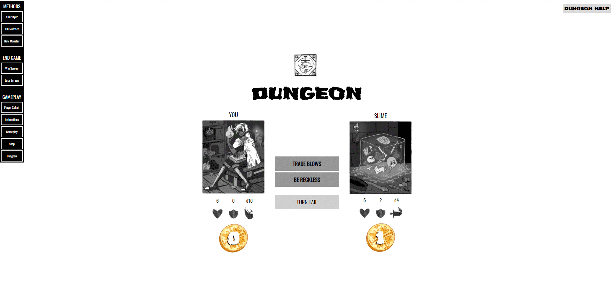
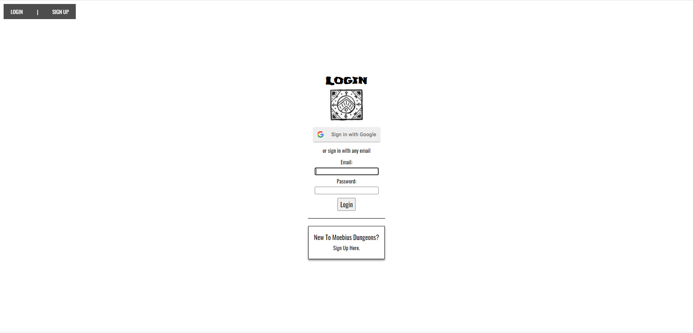
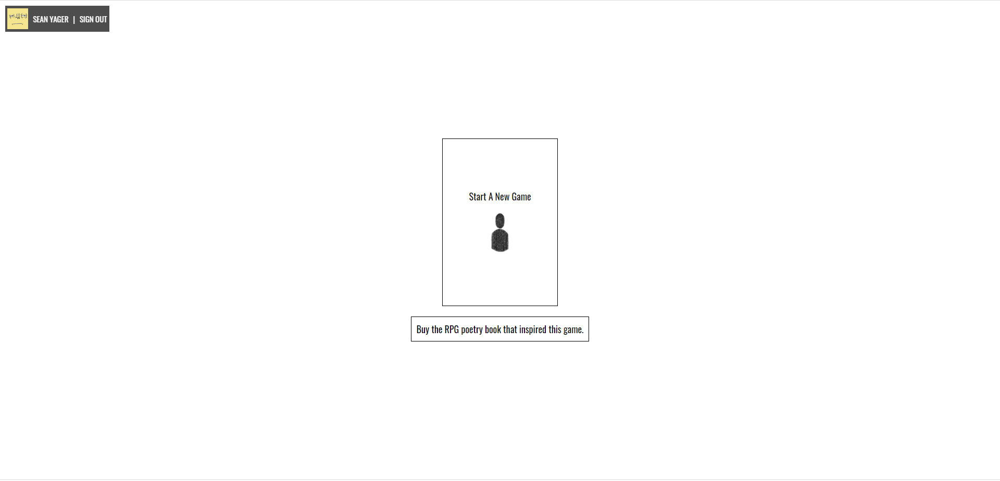
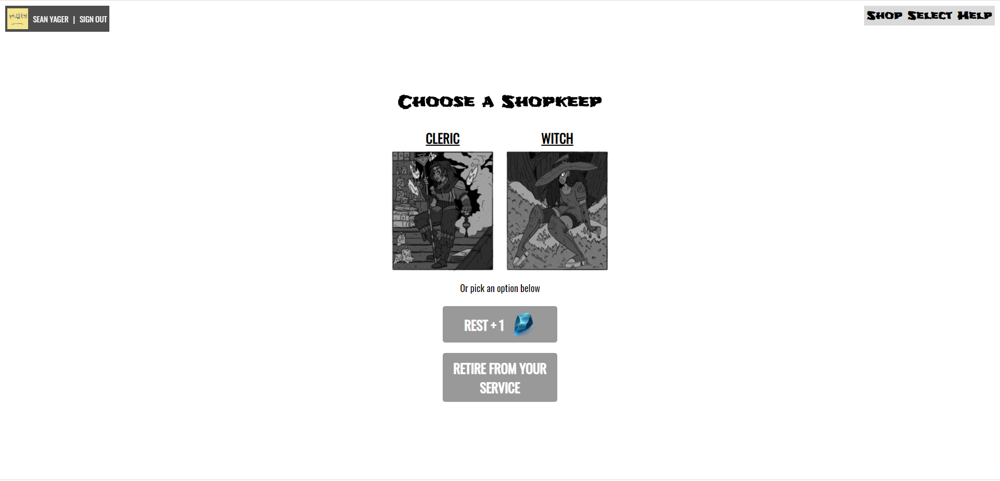
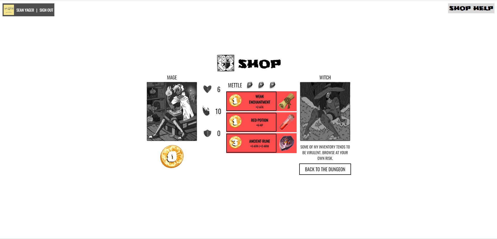

# Moebius Dungeons (MoDun) - A Browser RPG Roguelike Game


:crossed_swords: :shield: :european_castle: :medal_military:

A Vue SPA Dungeon Crawler game based off of the Dungeons Of Amara Playable RPG Book
[Dungeons Of Amara Book](https://gum.co/CsdPh)

## Run MoDun Locally
```
1. clone repo
2. cd into local folder
3. git checkout 
    3a. checkout vuexRefactor branch for experimental changes
    3b. checkout the main branch for a stable release
4. npm run serve to run on local host
```


## What is this?
Moebius Dungeons is an RPG browser game built with Vue, Javascript, HTML, and CSS.
The project is based off of Sean Yager's gameified book titled ["Dungeons Of Amara"](https://gum.co/CsdPh)

## Moebius Dungeons is an Expirement in Vue.js 
Moebius Dungeons was developed as an expiriment while completing my Full Stack Certification from Austin Coding Academy. Over the course of 2020 the game took on many different iterations as my full stack comprehension grew. Moebius Dungeons started as a Javascript/Jquery, HTML, and CSS project without any framework, toggling between game phases using Jquery displays and tracking information in a simple Json Tree.

Scaling up and looking ahead to what I wanted the game to become I realized quickly I was outgrowing the scope of what just JS/Jquery, HTML, and CSS alone could do for me. 

Here's a little gif of the difference in UI when I upgraded to using Vue.js. The interface became much cleaner, more visually involved, and more organized with the modularity that Vue.js Framework offered with it's reusable Components.



## How To Play Moebius Dungeons

Moebius Dungeons is a leaderboard game, players compete for the highest score against other fellow Kingloyal Knights (other players who can delve the dungeons and achieve their own high scores).

Scores are based on a myriad of conditions, your highest health, damage dealt, items bought, damage blocked, and many other stats. The Top Ten highest scoring Kingloyal will be displayed in the leaderboards at the beginning of the game.

Planned implementations are as follows:
- [ ] Leaderboards for Highest Scoring Kingloyal Knights
- [ ] Game Progress Saved during every new turn in all phases of gameplay
- [ ] Refactoring playable Character Classes Special Moves
    - [ ] Variagation for mage should halve the enemies health per use
    - [ ] Rogue should be able to steal the coin value from an enemy and move on to the shop select phase
    - [ ] Swordsman gains 2 temporary armor, armor lasts until an enemy deals damage to you.
- [ ] Saved game resumes on re-logging in
- [ ] Mixing and mastering the Audio in the game to be consistent volume
- [ ] Adjust Howler plugin to include audio volumes in the plugin

## Gameplay Images
### Login Screen
Players can log in or register via any email addres or their google email account.



### Start Game / Load Game Screen
Once logged in players will have the opprotunity to either start a new game or resume from their last session. The game will automatically save your progress as you play, allowing for players to resume their last game without having to manually save if their internet cuts out, or their browser crashes, they will always have their actions recorded up until the loss of connection or accidental closing of a browser tab.



### Dungeon Phase, Shop Select, Shop Phase
The core gameplay loop of Moebius Dungeons is Dungeon Phase > Shop Select > Shop Phase :repeat:





More to come... Stay Tuned!