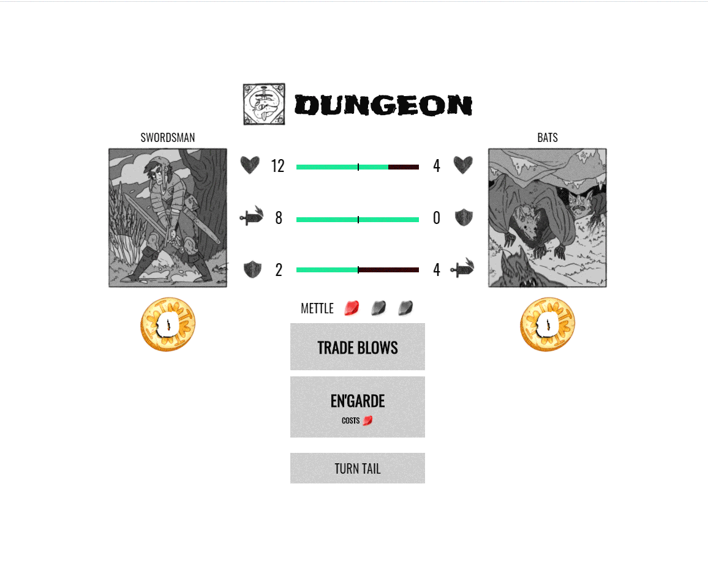
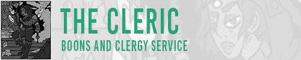
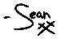

# Moebius Dungeons (MoDun)
## A Browser RPG Roguelike Game

<br>

### Table of Contents
[Inspired By D.O.A.](#inspired-by-dungeons-of-amara)

[How to Run MoDun Locally](#run-modun-locally)

[What is Moebius Dungeons?](#what-is-moebius-dungeons-)

[How To Play Moebius Dungeons](#how-to-play-moebius-dungeons)

- [The Gameplay Loop :repeat:](#the-gameplay-loop--repeat-)
    - [Dungeon Phase :skull:](#dungeon-phase--skull-)
    - [Trade Blows :crossed_swords:](#trade-blows--crossed-swords-)
    - [Special Abilities :sparkle:](#special-abilities--sparkle-)
        + [En'garde](#en-garde)
        + [Variagate](#variagate)
        + [Peculate](#peculate)
    - [Turn Tail](#turn-tail)
- [Shop Select Phase :money_with_wings:](#shop-select-phase--money-with-wings-)
  * [Pick a Shopkeep :busts_in_silhouette:](#pick-a-shopkeep--busts-in-silhouette-)
  * [The Merchant](#the-merchant)
  * [The Cleric](#the-cleric)
  * [The Graverobber](#the-graverobber)
  * [The Witch](#the-witch)
  * [Rest to Regain Mettle :sleeping:](#rest-to-regain-mettle--sleeping-)
  * [Retire](#retire)
- [Shop Phase](#shop-phase)

<br>
<hr>
<br>


# Inspired By Dungeons Of Amara
:crossed_swords: :shield: :european_castle: :medal_military: :crown:

A Vue SPA Dungeon Crawler game based off of the Dungeons Of Amara Playable RPG Book

[](https://gum.co/CsdPh)

<br>

# Run MoDun Locally

```
1. clone repo
2. cd into local folder
3. git checkout 
    3a. checkout vuexRefactor branch for experimental changes
    3b. checkout the main branch for a stable release
4. npm run serve to run on local host
```


<br>

# What is Moebius Dungeons?
Moebius Dungeons is an RPG browser game built with Vue, Javascript, HTML, and CSS.
The project is based off of Sean Yager's gameified book titled ["Dungeons Of Amara"](https://gum.co/CsdPh)

## Moebius Dungeons is an Expirement in Vue.js 
**This project is being developed as an expiriment while completing my Full Stack Certification from Austin Coding Academy with a focus on the React framework.** 

Over the course of 2020 the game has taken on many different iterations as my full stack comprehension grew.

Moebius Dungeons started as a Javascript/Jquery, HTML, and CSS project without any framework, toggling between game phases using Jquery to show and hide HTML elements and tracking information in a massive JSON Object.

Scaling up and looking ahead to what I wanted the game to become I realized quickly I was outgrowing the scope of what just JS/Jquery, HTML, and CSS alone could do for me. 

Rather than commit to using React, the framework I was being taught through Austin Coding Academy, I wanted to grab ahold of the opprotunity to learn two frameworks at once.

Here's a little gif of the difference in UI when I upgraded to using Vue.js. The interface became much cleaner, more visually involved, and more organized with the modularity that Vue.js Framework offered with it's reusable Components.

<br>

# How To Play Moebius Dungeons
Moebius Dungeons is a leaderboard game, players compete for the highest score against other fellow Kingloyal Knights (other players who can delve the dungeons and achieve their own high scores).

Scores are based on a myriad of conditions, your highest health, damage dealt, items bought, damage blocked, and many other stats. The Top Ten highest scoring Kingloyal will be displayed in the leaderboards at the beginning of the game.

Planned implementations are as follows:
- :chart_with_upwards_trend: Leaderboards for Highest Scoring Kingloyal Knights
- :floppy_disk: Game Progress Saved during every new turn in all phases of gameplay
- :sparkles: Refactoring playable Character Classes Special Moves
    - Variagation for mage should halve the enemies health per use
    - Rogue should be able to steal the coin value from an enemy and move on to the shop select phase if special ability kills the monster
    - Swordsman gains 3 temporary armor, armor lasts until a physical enemy deals damage to you.
- :floppy_disk: Saved game resumes on re-logging in
- :sound: Mixing and mastering the Audio in the game to be consistent volume
- :loudspeaker: Adjust Howler plugin to include audio volumes in the plugin


<br>

# The Gameplay Loop :repeat:

The core gameplay loop of Moebius Dungeons is Dungeon Phase... :arrow_forward: Choose a Shopkeep... :arrow_forward: Shop Phase... :arrow_forward: Dungeon Phase... :repeat:



<br>

# Dungeon Phase :skull:
During the Dungeon phase the player must slay a terrible monster by reducing its Health to 0 (zero). The player has three choices available to them. Trade Blows, Special Ability (Unique to each class), and Turn Tail.

Additionally there are four icons representing your stats and the monsters:

 

- HEALTH
- ARMOR
- ATTACK
    - Either MAGIC or PHYSICAL

<hr>

## Health: 
is reduced by Physical or Magical attacks.
## Armor:
is permenant, and reduces incoming Physical attack values 1 to 1.
## Attack:
##### Magic or Physical
is your maximum possible damage, you can deal anywhere from 1 to your maximum listed value by your attack icon.

<hr>

## Trade Blows :crossed_swords:
The player attacks the monster, dealing a random amount of damage between 1 and their attack maximum. If the monster survives the attack then the player is attacked back, the monster deals their own damage between 1 and their attack maximum. The attack maximum is represented by the numbers next to the black sword or flame icon.


The fire icon represents magic damage, and is unaffected by armor values. That's to say if you play as a mage, your attacks will pass through enemy armor, dealing full damage every time. However, some monsters also have magic attacks, so beware!

The sword icon represents physical damage and is negated by armor. If you deal 10 damage and an enemy has 5 armor you'll only deal 5 damage with physical damage.

<hr>

## Special Abilities :sparkle:
Each class has a special ability, costing mettle to use. This resource (mettle), doesn't recharge on it's own and can be regained via resting in-between battles or through certain consumables. 
**Using an ability will not cause the monster you're fighting to retaliate.**


### En'garde
The Swordsman's ability (En'Garde) grants +3 armor which reduces incoming physical damage. The ability can be used up to three times in a row granting a total of +9 armor. This bonus armor remains active until the Swordsman fails to block a physical attack.


### Variagate
The Mage's ability (Variagate) reduces the enemies health by half. This can be useful in a pinch, and can make quick work of endgame level monster. As this ability can be used 3 times in a row with full Mettle, the mage can weaken a 100HP monster to 50HP, then 25HP, then to 13HP. *A powerful ability indeed!*


### Peculate
The Varlet's ability (Peculate) allows for stealing coins when used to kill a monster. The ability deals exactly 1/4 of your maximum attack rounded down, and ignoring armor of any kind.

Peculate **must be used to deal the killing blow to a monster to provide coins.**. Unlike the other class abilities, Peculate is a long con ability that requires pre-planning and setup, with a little luck mixed in. It's much more difficult to use effectively than the other abilities but pays off when used properly.

### Example: 
    A monster has 12HP and your Max Attack is 8. You have one use of Peculate, which will deal 2 damage (1/4 of 8) per use. The monsters health must be 2 or less in order for Peculate to work properly.

Peculate when used as the killing blow, grants the Varlet **2 more coins** on top of the coins you receive for defeating the monster.

## Turn Tail
Players have the option to **Turn Tail**, and attempt to escape the current encounter. This option is easier to succeed at when you have high health. The mechanic weighs your health against the monsters and a random roll is added to your escape attempt value. Your health total gets added to your escape roll and must be higher than what the monster rolls for you to escape succefully.

On a successful escape you leave the monster behind, and move on to the Shop Select Phase. You gain no coins from the monster you fought.

<br>

<br>

# Shop Select Phase :money_with_wings:
Players have three options during this phase.

- Pick between two shopkeepers
- Rest to regain Mettle
- Retire

<hr>

## Pick a Shopkeep :busts_in_silhouette:
Two random shopkeepers appear and the Player can choose to visit either Shopkeep.

Each shopkeep has different stock available, you'll have to play the game to learn more about their unique inventories. Here's a few swift teasers though:

## The Merchant 


## The Cleric


## The Graverobber


## The Witch


<hr>

## Rest to Regain Mettle :sleeping:
Players can choose to skip the Shop Phase entirely in exchange for regaining 1 mettle use. This is a great way to build up a safety net to unleash your full potential with your ability and save some coin while you're at it.

<hr>

## Retire
Playes **MUST** retire their game in order to be eligible for leaderboard submission. A player that does not retire from their adventure *and instead is killed in battle* **will lose all progress and forefit their chance to be placed in the leaderboard.**

This is the most important crux in **Moebius Dungeons**. The player must choose to end their run in safety to go on and tell of their epic journey.

<br>

# Shop Phase
Players are able to spend the coins they earn when slaying monsters in this phase. Depending on the shopkeep you selected in the previous phase you'll have access to different items.

The effects of these items range from replenishing your health, to imparting one time magical effects, to bringing you back from the brink of death!

Play around in the shops and get a feel for your favorite items.


# Rinse and Repeat!
That's the core gist of Moebius Dungeons, thanks for reading this far.
I'm always happy to hear from fans so reach out to say hi! I'm on most social media [@MisuseOfMana](https://www.instagram.com/misuseofmana)

If you have any recommendations for Moebius Dungeons please send your feedback to moebiusdungeons@gmail.com

##### Your pal,
